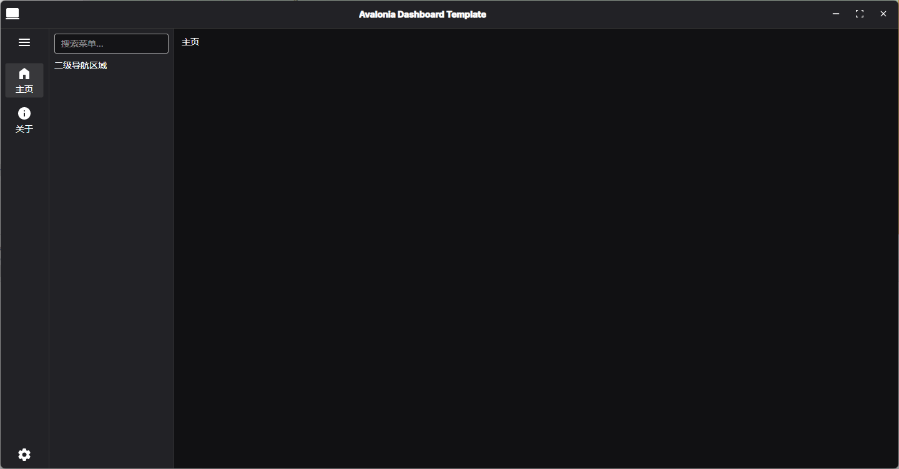
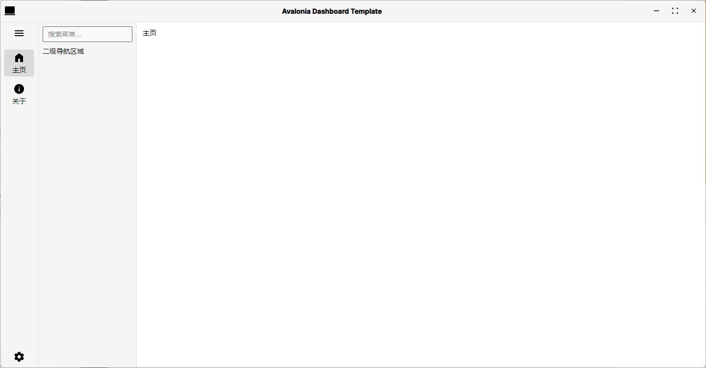

# VSSL · Vintage Story Server Launcher

VSSL 是一个面向《Vintage Story》独立服的桌面启动与运维工具，核心目标是把版本下载、实例创建、配置维护、日志控制台、存档管理、模组管理、地图预览和 QQ 机器人联动集中到同一套界面里。

## 项目状态

项目处于持续开发阶段，界面和功能仍在迭代，部分页面已经可用，个别页面仍为占位实现。

## 界面预览

| 预览类型 | 图像 |
| --- | --- |
| 动态演示 |  |
| 深色主题 |  |
| 浅色主题 |  |

## 面向用户

应用采用三段式布局，顶部为窗口控制和仓库入口，左侧为一级导航，中间为二级菜单与业务页面。首次启动会弹出引导窗口选择默认主题和默认语言，当前支持简体中文与英文。

| 模块 | 用户价值 | 当前行为 |
| --- | --- | --- |
| 总览 | 统一查看服务器与机器人状态。 | 展示运行状态、内存占用、运行时长、在线人数和最近采样趋势图。 |
| 控制台 | 快速开服与日常控制。 | 支持快速创建并启动档案、启动停止服务端、发送命令、日志跟随、日志导出。 |
| 地图预览 | 不进游戏查看地形与坐标。 | 直接读取 `.vcdbs`，生成彩色图和灰度图，支持缩放、拖拽、坐标悬停。 |
| 实例下载 | 获取服务端包。 | 从官方 `stable-unstable.json` 读取条目，筛选 Windows Server 包并下载到本地工作区。 |
| 实例创建 | 管理档案生命周期。 | 按已下载版本创建档案，维护档案列表，支持批量删除。 |
| 配置 | 可视化编辑 `serverconfig.json`。 | 编辑服务端基础项、世界参数、世界规则，并支持高级 JSON 编辑。 |
| 存档 | 管理 `.vcdbs` 存档。 | 创建存档、切换当前存档、删除存档，自动回写当前档案配置。 |
| 模组 | 管理 Mods 目录。 | 导入 zip 模组，识别 `modinfo.json`，切换启用状态并提示依赖缺失。 |
| 机器人配置 | 配置 VS2QQ。 | 配置 OneBot WebSocket、令牌、轮询、编码、超级用户与数据库路径。 |
| 机器人控制台 | 管理 VS2QQ 运行态。 | 启停机器人、刷新与清空日志、查看运行状态和连接地址。 |
| 关于 | 版本与链接入口。 | 显示当前版本、检查 GitHub Releases 更新、打开仓库与社区链接。 |
| 反馈 | 问题上报入口。 | 一键跳转 Issue 页面。 |

| 典型使用路径 | 说明 |
| --- | --- |
| 下载服务端包 | 在“实例/下载”页面拉取并下载 `vs_server_win-x64_*.zip`。 |
| 创建档案 | 在“实例/创建”页面选择版本并创建档案。 |
| 检查配置 | 在“实例/配置”页面确认端口、世界规则和存档路径。 |
| 启动服务器 | 在“总览/控制台”页面启动并观察输出。 |
| 维护资源 | 在“实例/存档”和“实例/模组”页面完成日常维护。 |
| 机器人联动 | 在“机器人/配置”和“机器人/控制台”页面启用 VS2QQ。 |
| 地图核对 | 在“总览/地图预览”页面加载并查看地图和坐标。 |

## 数据目录

默认工作区位于 `%LOCALAPPDATA%\VSSL\workspace`。

| 路径 | 用途 |
| --- | --- |
| `launcher-preferences.json` | 启动器偏好设置，记录首启状态、主题和语言。 |
| `profiles.json` | 档案索引，维护所有实例档案元数据。 |
| `packages` | 下载得到的服务端压缩包。 |
| `servers\windows\<version>` | 解压后的服务端程序目录，包含 `VintagestoryServer.exe`。 |
| `data\<profileId>` | 档案数据目录，包含 `serverconfig.json`、`Logs`、`Mods`。 |
| `saves\<profileId>` | 档案存档目录，保存 `.vcdbs` 文件。 |
| `robot\vs2qq-settings.json` | VS2QQ 的本地配置文件。 |
| `exports` | 控制台导出日志输出目录。 |
| `.tmp` | 安装与中间流程使用的临时目录。 |

## 面向开发者

项目使用 .NET 10 与 Avalonia 11，采用 `VSSL.App` 启动层 + `VSSL.Ui` 界面层 + `VSSL.Services` 业务层 + `VSSL.Domains` 领域模型的分层结构，并通过依赖注入进行装配。

| 项目 | 作用 |
| --- | --- |
| `VSSL.App` | 进程入口、Host 构建、配置加载、日志初始化、首启引导触发。 |
| `VSSL.Ui` | Avalonia 视图、ViewModel、导航、主题与本地化服务。 |
| `VSSL.Services` | 下载、档案、配置、存档、模组、服务端进程、地图预览、机器人、更新检查等核心业务。 |
| `VSSL.Domains` | DTO、配置模型、运行状态、世界规则和菜单模型。 |
| `VSSL.Abstractions` | 业务与 UI 服务接口定义。 |
| `VSSL.Common` | 通用常量与工具。 |
| `VSSL.Tests` | xUnit 测试工程。 |

### 本地开发

```bash
dotnet restore VSSL.sln
dotnet build VSSL.sln -c Debug
dotnet run --project VSSL.App/VSSL.App.csproj
dotnet test VSSL.Tests/VSSL.Tests.csproj -c Debug
```

### 发布与打包

```bash
dotnet publish VSSL.App/VSSL.App.csproj -c Release -r win-x64 --self-contained true -p:Version=0.0.0-local -o artifacts/publish/win-x64
dotnet publish VSSL.App/VSSL.App.csproj -c Release -r win-x64 --self-contained true -p:Version=0.0.0-local -p:PublishSingleFile=true -p:IncludeNativeLibrariesForSelfExtract=true -o artifacts/publish/portable
```

Windows 安装包流程由 `.github/workflows/windows-packages.yml` 驱动，Inno Setup 脚本位于 `installer/VSSL.iss`。

### 扩展入口

| 扩展场景 | 入口位置 |
| --- | --- |
| 新增页面 | `VSSL.Domains/Enums/ViewName.cs`、`VSSL.Ui/Services/Ui/DefaultNavigationService.cs`、`VSSL.Services/Configs/menus.json`、对应 `View` 与 `ViewModel`。 |
| 新增服务 | 在 `VSSL.Services` 新增 `*Service` 类和接口，DI 会按命名约定自动注册。 |
| 菜单结构调整 | 修改 `VSSL.Services/Configs/menus.json`。 |
| 文案本地化 | 修改 `VSSL.Ui/Assets/I18n/Resources*.resx`。 |
| 主题行为 | 修改 `VSSL.Ui/Services/Ui/ThemeService.cs` 与主题资源文件。 |

### 机器人命令

内置 VS2QQ 支持 `/help`、`/bindqq`、`/unbindqq`、`/mybind`、`/bindserver`、`/unbindserver`、`/listserver`、`/bindserverregex`。

## 平台与限制

| 主题 | 说明 |
| --- | --- |
| 服务端下载源 | 当前下载流程聚焦 Windows Server 包，文件名模式为 `vs_server_win-x64_*.zip`。 |
| 实例管理页 | `Instance / Manage` 页面目前为占位内容。 |
| 工作区依赖 | 默认流程依赖本地工作区结构，手工移动文件后建议回到页面执行一次刷新。 |

## 许可证

本项目采用 GPLv3（GNU General Public License v3.0）许可证，详见 [LICENSE](LICENSE)。

## 链接

项目仓库地址为 <https://github.com/TGU-HansJack/vintage-story-server-launcher>，问题反馈地址为 <https://github.com/TGU-HansJack/vintage-story-server-launcher/issues>，中文社区地址为 <https://vintagestory.top/>。
